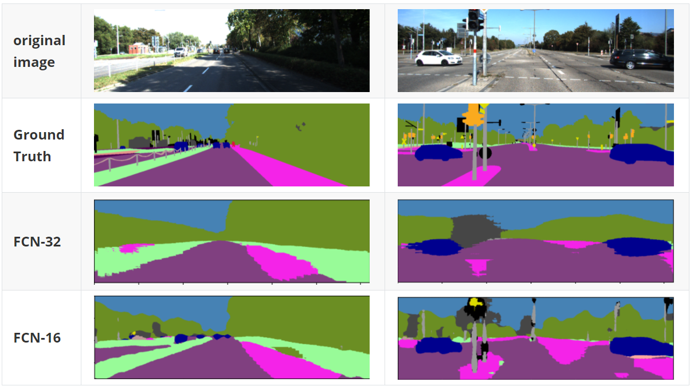

## ResNet based FCN

### source list:

|       source        |                         description                          |
| :-----------------: | :----------------------------------------------------------: |
|    **data set**     | [Kitti dataset](http://www.cvlibs.net/datasets/kitti/eval_semseg.php?benchmark=semantics2015) |
|    **FCN16.py**     |  FCN-16 model, *ResNet18* as pretrain classification model   |
|    **FCN32.py**     |  FCN-32 model, *ResNet18* as pretrain classification model   |
| **KittiDataset.py** |           custom dataset for semantic segmentation           |
|  **experiment.py**  |  1. dataset splitting 2. training and validation processing  |
|     **test.py**     |                         test process                         |
|    **labels.py**    |                   Kitti labels definition                    |

### Setting:

Unlike original FCN setting, both FCN in this report are based on ResNet18

All image are resize to (H: 375, W: 1242) to improve parallelism.

| max_lr | epoch | weight_decay | batch size | n_class |   criterion   | optimizer |
| :----: | :---: | :----------: | :--------: | :-----: | :-----------: | :-------: |
|  1e-3  |  30   |     1e-4     |     10     |   34    | cross entropy |   Adam    |

**Evaluation metrics:** 

1. Pixel-level intersection-over-union (pIoU)
2. Mean Intersection-over-Union (mIoU)

### Test Result

### Reference

[Kaggle](https://www.kaggle.com/ligtfeather/semantic-segmentation-is-easy-with-pytorch/notebook#Training), [github_fcn](https://github.com/wkentaro/pytorch-fcn), [github_layergetter](https://github.com/pytorch/vision/blob/main/torchvision/models/_utils.py), [FCN](https://arxiv.org/abs/1605.06211), [ResNet](https://arxiv.org/abs/1512.03385#)

